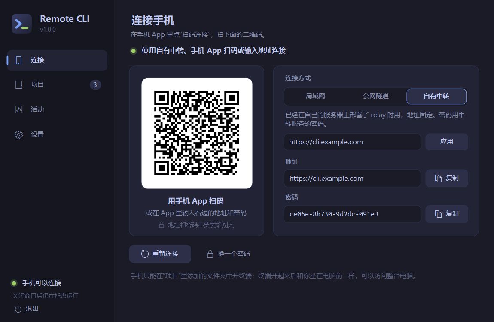
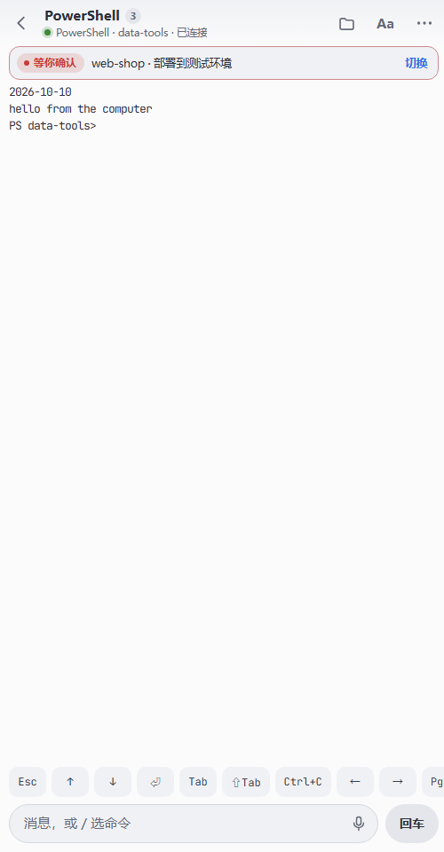
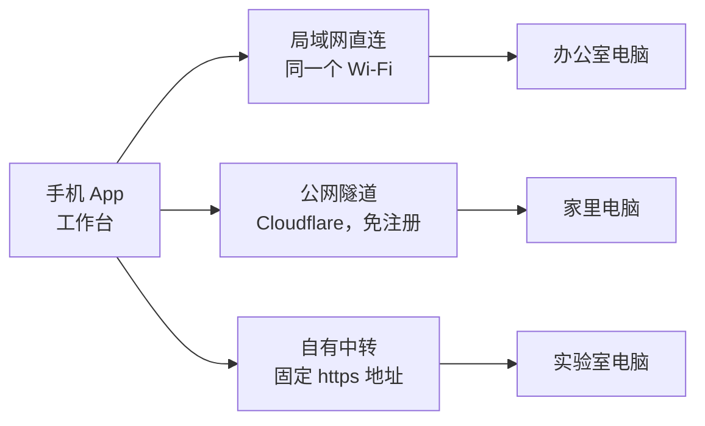
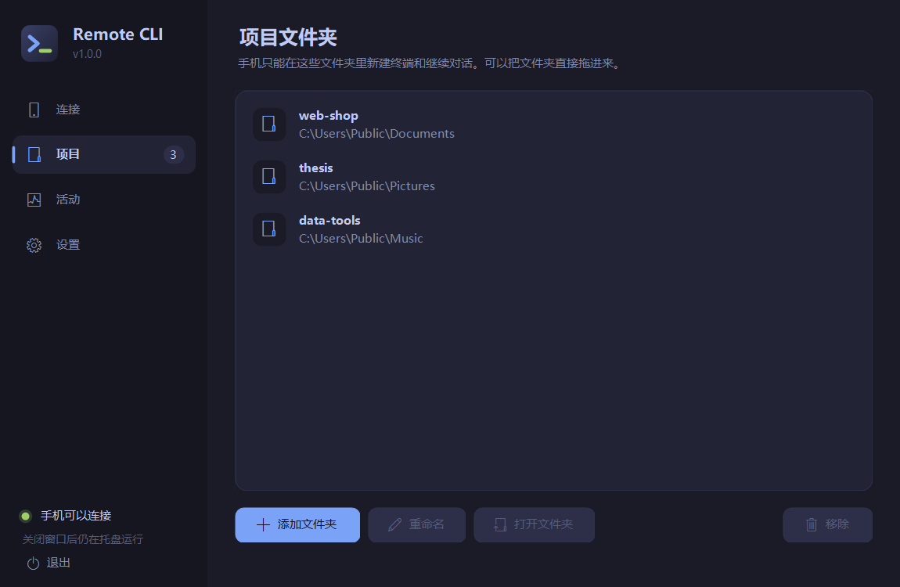
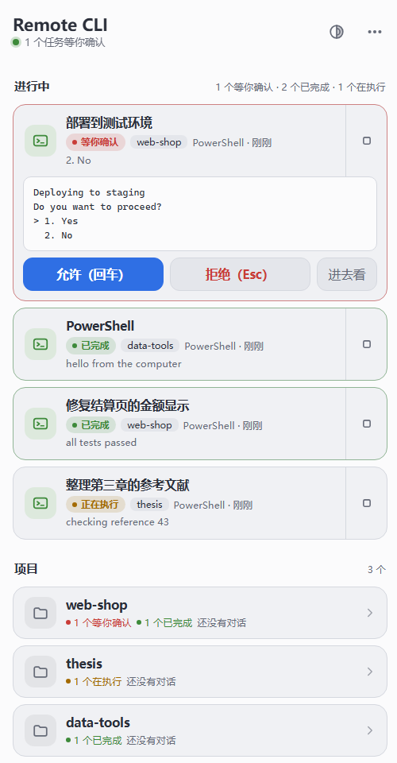
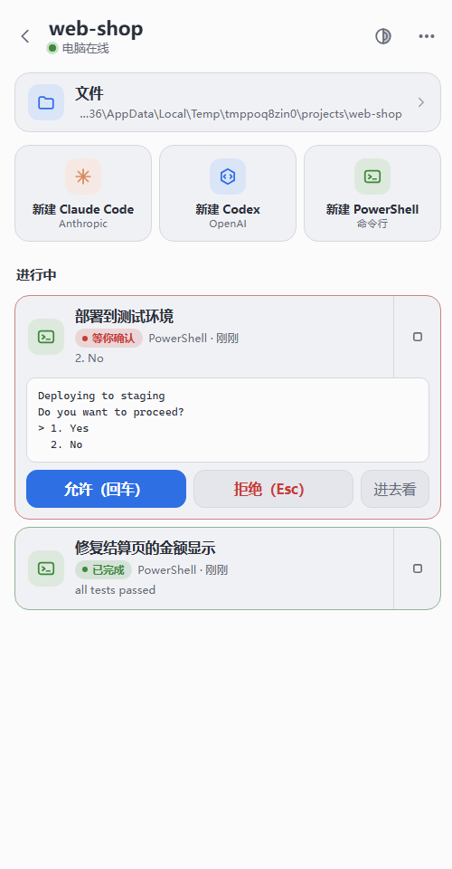
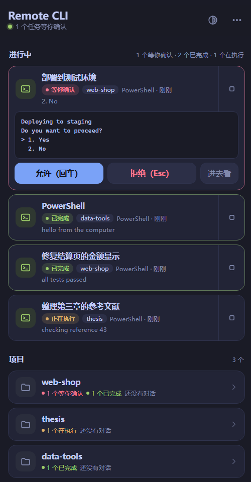
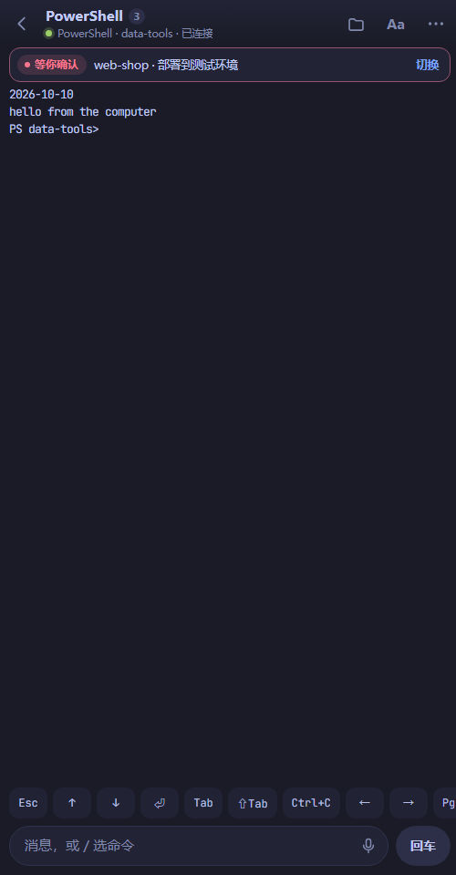
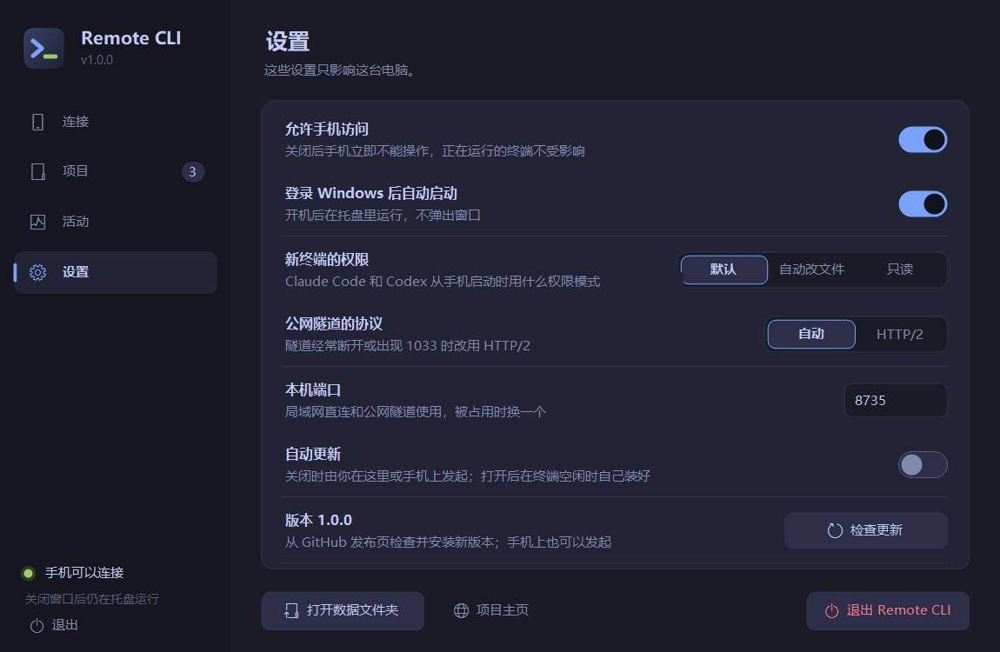

<h1 align="center">Remote CLI</h1>

<p align="center">
  <b>在手机上使用电脑里的终端、Claude Code 和 Codex。</b><br>
  电脑装一个程序，手机装一个 App，扫码连上。
</p>

<p align="center">
  <a href="../../releases/latest"></a>
  
  
  <a href="LICENSE"></a>
</p>

<p align="center">
  <a href="#下载">下载</a> ·
  <a href="#五分钟上手">五分钟上手</a> ·
  <a href="#手机上怎么用">使用说明</a> ·
  <a href="#常见问题">常见问题</a> ·
  <a href="#安全">安全</a>
</p>

<p align="center"><i>Use your computer's terminal, Claude Code and Codex from your phone. One program on the computer, one app on the phone. The interface is in Chinese for now.</i></p>

<p align="center">
  
  &nbsp;
  
  &nbsp;
  
</p>

## 为什么用它

<table>
  <tr>
    <td width="50%" valign="top">
      <h3>一部手机，多台电脑</h3>
      办公室、家里、实验室的电脑各扫一次码，App 全部记住。首页的工作台把它们放在一起：每台是否在线、各有几个任务在等你，一屏看完。一台关机或连不上，不影响查看其它电脑。
    </td>
    <td width="50%" valign="top">
      <h3>一步跳到要处理的任务</h3>
      所有电脑上正在运行的任务排成一列，等你确认的在最前，其次是已完成还没看过的。点一下直接进入那个终端；在终端里点标题，可以切换到同一台电脑的其它任务，不用退回列表。
    </td>
  </tr>
  <tr>
    <td width="50%" valign="top">
      <h3>随时随地，离开也不中断</h3>
      终端运行在电脑上。关掉 App、锁屏、换网络，任务照常执行；地铁上打开 App，接着刚才的画面继续。在外面可以回答确认提问、发下一条指令，也可以用语音输入。
    </td>
    <td width="50%" valign="top">
      <h3>三种连接方式，不需要服务器</h3>
      同一个 Wi-Fi 下直连，最快；人在外面，一键建立 Cloudflare 临时隧道，不用注册账号；有自己的服务器，可以部署中转获得固定地址。三种方式在电脑端一点即换，手机重新扫码即可。
    </td>
  </tr>
</table>



每台电脑各自选择连接方式，手机上统一管理。

**还有这些**

| | |
| --- | --- |
| 真实终端 | 电脑上用 ConPTY 运行 `claude`、`codex` 或 PowerShell，手机上看到的就是它的画面，可以输入、按键、翻看 |
| 接着电脑上的对话 | 列出 Claude Code 和 Codex 保存的对话，点开就继续；Codex 可接手电脑上的独立 CLI，也可保留电脑会话、在手机新开带历史的副本 |
| 状态一目了然 | 等你确认、已完成、正在执行、等待输入各有一种颜色，工作台、列表和终端里用的是同一套 |
| 六套外观 | 默认是明亮的“纸白”，另有一套明亮和四套深色，工作台、列表和终端一起换；文字大小和终端行距可调 |
| 软件内更新 | 电脑端和 App 都会检查新版本，下载并校验后安装 |

## 下载

在 [Releases](../../releases/latest) 下载两个文件：

| 文件 | 装在哪 |
| --- | --- |
| `RemoteCli-Setup-x.y.z.exe` | Windows 10 / 11（64 位）电脑。装到当前用户目录，不需要管理员权限，不需要另装 Python |
| `RemoteCli-Android.apk` | 安卓 8.0 及以上的手机 |

两个文件都没有购买代码签名证书：Windows 会提示“未知发布者”（点“更多信息 → 仍要运行”），安卓会提示“未知来源”（允许本次安装）。发布页的 `SHA256SUMS.txt` 可以核对文件；介意的话可以按文末“自己构建”从源码生成。

**更新。** 电脑端启动、手机端启动或回到前台时会检查 GitHub Releases 的最新正式版本，自动检查最多每 6 小时一次。发现新版本后会提示：电脑端下载并校验安装包，等当前程序退出后自动替换并重启；手机端校验 APK 后交给 Android 系统安装器，第一次可能需要允许“安装未知应用”。更新只接受本仓库 `KangWang42/remote-cli` 的 HTTPS 发布文件。也可以手动检查：电脑端在“设置”页最下面一行；手机在工作台底部的“版本 x.y.z · 检查更新”，或进入一台电脑后右上角“···”里的“检查 App 更新”。

## 五分钟上手

### 第 1 步：电脑上安装并打开

运行 `RemoteCli-Setup-x.y.z.exe`。安装位置可以改，点“浏览…”选别的盘或文件夹；选了已有内容的文件夹时，程序会装进里面新建的 `RemoteCli` 文件夹。


装完会自动打开主窗口，桌面和开始菜单里也会有 Remote CLI 的图标。以后想换位置，再运行一次安装程序选新位置即可，设置和密码会保留。

### 第 2 步：添加项目文件夹

第一次打开会停在“项目”页。点“添加文件夹”选你平时写代码的文件夹，或者把文件夹直接拖进窗口；可以加多个，也可以改名、移除。手机只能在这里列出的文件夹里开终端。



### 第 3 步：选连接方式

| 方式 | 什么时候用 | 要做什么 |
| --- | --- | --- |
| 局域网直连 | 手机和电脑连着同一个 Wi-Fi | 直接选它。第一次会弹出 Windows 防火墙询问，选“允许”。最快 |
| 公网隧道 | 人在外面，手头没有服务器 | 点“下载隧道程序”，确认后程序从 Cloudflare 的 GitHub 发布页下载 `cloudflared`（约 60 MB，只需一次），几秒后得到一个 https 地址。不需要注册账号 |
| 自有中转 | 有自己的服务器，想要固定地址 | 见下面“自己部署中转” |

在“连接”页上方选方式。状态一行变成绿色、左边出现二维码，就可以用手机连了。

更新程序时隧道保持运行，地址不变，手机不用重新扫码；退出程序或重启电脑后地址会变，重新扫码即可。Cloudflare 不对这种临时隧道的可用性做保证，也需要你的网络能访问 GitHub 和 Cloudflare。隧道经常断开或手机上出现 1033 错误时，到“设置”把“公网隧道的协议”改为 HTTP/2。


### 第 4 步：手机上安装 App 并扫码

1. 在手机上安装 `RemoteCli-Android.apk` 并打开。
2. 点“扫码添加电脑”，第一次会询问相机权限，允许后对准电脑窗口里的二维码，识别到就自动连上。
3. 不想给相机权限或扫不了时，点“手动输入地址”，把电脑窗口里的“地址”和“密码”填进去。用手机系统相机扫那个二维码也可以，会跳回 App。

相机画面只在手机上用来找二维码，不保存也不上传。连上一次后 App 会记住这台电脑，90 天内不用再输密码。

## 手机上怎么用

App 有三层：**工作台**（所有电脑）→ **一台电脑**（它的项目和任务）→ **终端**。常用的路径是打开 App、在工作台点一个任务、直接进终端。

### 工作台：所有电脑和进行中的任务


只连了一台电脑时，打开 App 直接进入这台电脑；连了两台或更多时，打开 App 先看到工作台。在一台电脑的首页点左上角的“‹”，或按系统返回键，都能回到工作台。

- **进行中。** 所有电脑上开着的任务排在一起：等你确认的最前，其次是已完成还没看过的、正在执行的、等待输入的，最后是电脑上正在运行的 CLI 会话。每行标着状态、项目和所在的电脑。点手机终端直接进入，这时终端页左上角的“‹”回到工作台；点电脑 CLI 会话会直接问你怎样接管它，不用先进那台电脑。最多列 12 个，其余的在各自的项目里。
- **电脑。** 每台电脑一张卡片：圆点和一行文字说明它在线、离线还是需要重新登录，以及有几个任务等你。卡片里是它的项目，有任务在运行的排在前面，并按状态分别标出数量（等你确认、已完成、在执行），默认显示 4 个，点“其余 N 个项目”展开。点一个项目，它的对话就在工作台里展开：进行中的终端点开即进，历史对话点开即继续，再点一次项目收起；展开部分最下面一行进入项目，用来新建终端或查看更多历史。点电脑名称进入这台电脑的首页。同名项目始终分属于各自的电脑。
- **管理电脑。** 右上角的“＋”或列表末尾的“添加电脑”可以再扫一台。点电脑卡片右侧的“···”（或长按卡片）可以改名、重新扫码登录、从列表移除。电脑离线或登录过期时，卡片里会直接给出原因和“重新扫码”按钮。

“进行中”的每个手机终端下面有一行小字，是它的程序最近说的一句话或正在做的事，随刷新更新，不用点进去就知道大概进展。

每台电脑单独读取，每 6 秒刷新一次；一台关机或连不上不会拖慢其它电脑。项目没有展开时只显示对话数量；展开后最多列出 8 段历史对话，其余的进项目后查看。

**外观。** 工作台右上角的圆形按钮设置外观，对所有电脑生效：“App 外观”用于工作台和每台电脑的列表；“终端外观”默认跟随 App，也可以单独选一套，例如列表用纸白、终端用夜航。

### 一台电脑：所有项目

 

最上面的“进行中”把这台电脑**所有项目**里开着的任务放在一起，最需要你的排在最前；下面是项目，每个项目也标着有几个任务等你处理。每个任务的状态各有一种颜色，工作台里用的是同一套：

| 状态 | 颜色 | 含义 |
| --- | --- | --- |
| 等你确认 | 红 | 程序停在一个是 / 否的提问上，例如是否允许执行命令 |
| 已完成 | 绿 | 干完了一轮活，你还没有点开看过 |
| 正在执行 | 黄 | 正在工作 |
| 等待输入 | 灰 | 空着，等你的下一条消息 |
| 正在启动 | 蓝 | 刚开，还没起来 |
| 已结束 / 异常退出 | 灰 / 红字 | 终端已经结束；异常退出是程序带着错误代码退出 |

“等你确认”是根据终端画面上的提问文字判断的，偶尔会判断错；任务卡片上的那行小字取自终端当前画面里最后一段话，画面里只有菜单或提示时可能不准。其余状态来自程序自身或最近有没有输出；只是重画画面的输出不算在执行，例如刚打开时的欢迎画面、在手机上打开终端引起的重绘、还没按回车的按键回显。

右上角的圆形按钮换配色和文字大小。在这里选的配色就是 App 外观，换到另一台电脑也是同一套，不随电脑变；下面两张是深色的“夜航”；“···”里可以添加项目、回到工作台、检查 App 更新、退出登录。

 

### 一个项目

- **新建。** 上面三个大按钮在这个项目文件夹里新建 Claude Code、Codex 或 PowerShell 终端。只显示电脑上装了的工具。
- **电脑 CLI 运行中。** 已核实的独立命令行会话，可接手。共享后台、其它远程终端或归属不明的写入锁会折叠在“历史会话仍被后台锁定”里：它们不计入电脑运行中的数量，也不表示电脑有可见窗口；点开 Codex 记录仍可新开带历史的副本。共享锁要接管时，先在原应用中结束并关闭对应会话，再检查接管。
- **历史对话。** 这个文件夹里保存过的对话，点开就继续；多的时候可以搜索。
- **最近结束。** 刚结束的终端，点开能看到它最后的画面。
- **文件。** 项目名下面的“文件”一行打开这个项目文件夹，见下面的“查看文件”。

电脑端“活动”页与手机使用同一份会话列表。双击手机创建的 Claude Code 或 Codex 终端，确认后会先结束手机终端，再在电脑打开同一个会话；手机端会显示终端已结束。PowerShell 没有可恢复的会话，只能在电脑端重新新建。

### 终端页


| 位置 | 作用 |
| --- | --- |
| 下面一行按键 | Esc、方向键、回车、Tab、Shift+Tab、PgUp、PgDn、Ctrl+C，左右滑动可以看到全部 |
| 输入框 | 输入后点“发送”；空着点“回车”相当于按一次回车。输入 `/` 会列出 Claude Code 或 Codex 的常用命令 |
| 话筒 | 系统语音识别，识别结果先进输入框，确认后再发送 |
| 手指上下拖动 | 按屏幕帧翻看之前的内容，松手后短暂惯性滑动；新触摸或反向拖动会停止惯性 |
| 右上角文件夹 | 打开这个终端所在项目的文件；看完按左上角 ‹ 或手机的返回键回到终端，终端一直在电脑上运行 |
| 右上角 Aa | 切换字号（四档） |
| 右上角 ··· | 更换外观（只改终端自己的外观，也可以选回“跟随 App 外观”）、行距（紧凑、适中、宽松）、重命名、复制终端画面、结束终端；画面花屏时可以改用兼容绘制。重命名和结束终端在同一块底部面板里填写和确认 |
| 左上角 ‹ | 回到来的地方（工作台或这台电脑的列表），终端继续在电脑上运行 |
| 点标题 | 切换到这台电脑上别的正在运行的终端，不用先回列表；标题旁的数字是另外还有几个在运行 |
| 标题下出现的一行 | 别的任务完成了或在等你确认，点“切换”直接过去 |

### 查看文件

在手机上翻看项目文件夹，像资源管理器一样逐层进入；点文件直接查看，不用先传到手机。只读，不会改动电脑上的任何文件。

| 文件 | 怎么显示 |
| --- | --- |
| 代码和文本 | 带行号和语法着色，配色随当前外观；长行可左右滑动，也可在右上角改为自动换行 |
| Markdown | 排好版的文档，含表格、代码块、任务列表和同文件夹里的图片；可切换到源码 |
| Jupyter 笔记本 | 按单元格显示文字、代码和已保存的输出（文本、表格、图片） |
| Word（docx） | 文档的文字、标题、列表、表格和图片 |
| Excel（xlsx、xls）和 CSV | 表格，多张表可切换；首行和行号固定；最多显示前 2000 行、80 列 |
| PowerPoint（pptx） | 每一页的标题、文字、表格和图片，不是原来的版式 |
| PDF | 逐页显示，滚动到哪页画哪页 |
| 图片 | 适应屏幕，点一下看原始大小 |

右上角可以按名称、修改时间或大小排列，显示隐藏的文件。预览有大小上限（文本 3 MB，图片和表格 30 MB，Word 40 MB，PDF 和演示文稿 60 MB），超过的和不认识的类型只显示名称和大小。

任何文件都可以保存到手机：查看时点右上角“···”里的“保存到手机”，不能预览的文件页面上直接有这个按钮。文件放在手机的“下载 / RemoteCLI”里（Android 10 及以上），保存后可以立即用手机上的其它应用打开；单个文件上限 300 MB。在浏览器里使用时，按浏览器的普通下载处理。

### 更新电脑端

人不在电脑前也可以更新电脑端：在一台电脑的页面右上角“···”里，能看到电脑端当前版本；有新版本时点“更新电脑端”，没有时点“检查电脑端更新”。更新时手机会断开几秒，之后自动恢复：公网隧道的地址不变；Claude Code 和 Codex 的终端接回原来的对话，PowerShell 终端在原文件夹重新打开。正在执行的任务会被这次重启打断，请等它们做完再更新。

电脑端“设置”里另有“自动更新”开关，默认关闭；打开后，电脑端每十分钟检查一次，在没有终端忙碌时自己更新。

### 外出和单手使用

- 需要点的东西都不小于一个指尖，选项从屏幕底部弹出，拇指够得到。
- 离开 App 不影响电脑上的任务。回来时工作台和列表会立即刷新，“已完成”的标记保留到你点开看过为止。
- 在外面用公网隧道或自己的 https 中转；`http://` 开头的局域网地址只适合家里或办公室的 Wi-Fi。
- 连接断开时 App 会回到工作台并说明原因。电脑端更新后隧道地址不变，等它重新启动即可；退出后重新打开或重启电脑，隧道地址会变，点“重新扫码”即可，原来的名称会保留。

## 停止和卸载

- 关掉电脑上的窗口只是收到右下角托盘，手机仍然能连。要停止，在托盘图标上点右键选“退出”。
- “设置”里关掉“允许手机访问”可以立刻挡住手机，不用退出程序。
- “活动”页能看到手机上开着哪些终端、各自在执行还是在等输入。



- 卸载：Windows“设置 → 应用”里找到 Remote CLI，或运行安装目录里的 `Uninstall.exe`。只删除安装程序放进去的文件，同一文件夹里的其他东西不动。

## 常见问题

**手机提示连不上。** 局域网直连时确认手机和电脑在同一个 Wi-Fi，并且防火墙询问时选了“允许”（没选的话到“Windows 安全中心 → 防火墙 → 允许应用通过防火墙”里勾上 python）。公网隧道的地址在退出程序或重启电脑后会变，需要重新扫码；更新程序不会改变地址。

**电脑关闭后手机停在 1033 错误页。** 0.5.2 起，App 遇到隧道错误会自动回到工作台并提示重新扫码。正在查看终端时也会独立检查连接；短暂的网络波动先重试，连续两次检查失败才返回。请重新打开电脑端，再扫描新的二维码。

**手机更新提示 “file still open”。** 这是 0.5.4 之前的更新器在提交 APK 前还占用安装流导致的。旧版内部的更新器无法通过下载新版本修复自身，请从发布页手动下载最新 APK 覆盖安装一次，原有设置会保留；之后可继续使用 App 内更新。

**工作台里一个任务一直显示“已完成”。** 这个标记保留到你点开那个终端为止。在工作台点它，或在这台电脑的列表里点它，都算看过。

**列表里没有“新建 Claude Code”。** 按钮只显示电脑上能找到的工具。先在电脑的命令行里确认 `claude` 或 `codex` 能运行，再重新打开 Remote CLI。

**输入后要等一下才显示。** 终端优先使用 WebSocket 持续连接，输入和输出实时传输，连续按键不用逐次等待上一条请求完成。公网仍有网络往返延迟；同一个 Wi-Fi 下用局域网直连最快。连接不支持 WebSocket 时会自动切换到 HTTP，Cloudflare 临时隧道会跳过不能及时传输的 SSE。

**Codex 为什么有时只能新开副本？** 电脑端核实对话的写入锁和实际进程归属后，才提供“接手，并结束电脑上的 CLI 会话”。桌面应用或编辑器的共享后台可能同时管理多个对话，这时显示具体原因，并提供“在手机新开副本，保留电脑会话”。副本通过 `codex fork` 保留此前历史，之后各自继续；已结束的对话用 `codex resume` 恢复。结束 CLI 后，外层 PowerShell 窗口可能仍保留。新版手机页面需要新版电脑后台，旧后台会提示更新。

**电脑只显示一段对话，手机为什么列出其它标题？** Codex 桌面应用或编辑器可能保留旧对话的写入锁，另一套远程终端也可能在隐藏后台运行。它们折叠在“历史会话仍被后台锁定”里，并标明“后台锁定 · 没有可见窗口”“其它远程终端锁定”或“归属待确认”，不会计入电脑活动，也不结束这些进程。Codex 记录仍可新开副本；要接管原对话，先在原应用中结束并关闭它。

**电脑端活动页可以接管手机终端吗？** 0.5.3 起双击手机创建的 Claude Code 或 Codex 终端，确认后会结束手机终端并在电脑打开同一会话。接管前会重新核对进程和会话编号；核对失败会保留手机终端并提示原因。PowerShell 进程没有可恢复会话，只能重新新建。

**启动后马上结束。** 终端画面和退出代码会保留；检查画面中的 CLI 提示，例如登录状态、命令支持或工作目录。会话扫描遵循 `CODEX_HOME`，旧锁文件不会仅因存在而被显示为运行中。

**端口 8722 被占用。** 退出程序后，把 `%LOCALAPPDATA%\RemoteCli\config.json` 里的 `Port` 改成别的数字再打开。

## 安全

这个工具让拿到地址和密码的人在你的电脑上执行命令，请当作 SSH 密码一样对待。

- 密码由程序随机生成，在电脑上用 Windows 的 DPAPI 加密保存；中转只保存登录令牌的哈希。
- 同一地址连续输错 6 次密码会被锁 15 分钟，所有地址合计也有上限。
- 局域网直连走的是不加密的 http，只在可信的网络里用。在外面请用公网隧道或自己的 https 中转。
- 公网隧道的地址是随机的，但能被知道地址的人访问到登录页，保护它的只有密码。
- 手机只能在你添加的项目文件夹里启动终端，但终端启动后和你坐在电脑前一样，可以访问整台电脑。
- 查看文件只能读你添加的项目文件夹里面的内容；文件夹里指向别处的链接不会被打开。文件内容经中转传给手机，中转不保存。
- 中转和电脑端都不记录终端的输入输出到日志；中转把最近的终端画面保存在它的数据目录里，供手机重连后恢复显示。

发现安全问题请通过 GitHub 的私密漏洞报告提交。

## 组成

```
手机 App  ──HTTP(S)──▶  中转 relay（电脑上自带，或你自己的服务器）  ◀──HTTP(S)──  电脑端程序（运行终端）
```

| 目录 | 内容 |
| --- | --- |
| `agent-windows/` | 电脑端：`RemoteCliApp.cs`（窗口、托盘、连接方式）、`RemoteCliAgent.cs`（终端与对话扫描）、`QrCode.cs`、`Setup.cs`（安装程序）。C#，用 Windows 自带的编译器构建 |
| `relay/` | 中转：`server.py`（登录与 HTTP）、`relay.py`（终端状态与输出的转发）。只用 Python 标准库 |
| `android/` | 安卓 App：`MainActivity`（各界面之间的跳转、扫码回调、语音识别）、`Workbench`（工作台）、`Kit`（配色和界面部件）、`AggregateSessions`（任务分组与排序，不依赖 Android，可单独检查） |
| `web/` | App 里一台电脑的列表页和终端页（xterm.js），由中转提供、嵌在 App 内显示；随电脑端一起更新 |
| `docs/PROTOCOL.md` | 三方之间的接口，想写别的客户端或别的系统的电脑端看这里 |

电脑和手机都只向中转发起请求，电脑不需要公网地址或端口映射。

## 自己部署中转

需要 Python 3.9 及以上，没有其他依赖。

```bash
git clone https://github.com/KangWang42/remote-cli && cd remote-cli
RCLI_PASSWORD='一个足够长的密码' python3 relay/server.py --host 127.0.0.1 --port 8722 --data /var/lib/remote-cli
```

用 nginx、Caddy 等把一个 https 域名反向代理到 `127.0.0.1:8722`，然后在电脑端选“自有中转”，填这个地址，再点“换一个密码”填入同一个密码。nginx 的代理位置需要：

- `proxy_http_version 1.1;`、`proxy_set_header Upgrade $http_upgrade;` 和 `proxy_set_header Connection "upgrade";`，让终端优先使用的 WebSocket 升级请求能够通过；
- `proxy_buffering off;` 和不短于 60 秒的 `proxy_read_timeout`，供不支持 WebSocket 时回退到保持打开的 HTTP 响应。

不设 `RCLI_PASSWORD` 时，首次启动会生成一个密码，打印出来并保存在数据目录的 `password.txt`。

没有窗口的电脑端 `RemoteCliAgent.exe` 也在安装目录里，适合只用自有中转、想自己用计划任务启动的情况；它读取 `%LOCALAPPDATA%\RemoteCli\config.json`，密码用 `RemoteCliAgent.exe --set-password` 从标准输入写入。

## 自己构建

```powershell
# 电脑端（两个 exe），只需要 Windows 自带的 .NET Framework 4.x
powershell -ExecutionPolicy Bypass -File agent-windows\build.ps1

# 安装程序：会从 python.org 下载官方的嵌入式 Python 并核对哈希
python tools\package_windows.py

# 安卓：需要 JDK 11+ 和 Android SDK（build-tools 36.0.0、platforms/android-36），不需要 Gradle
powershell -ExecutionPolicy Bypass -File android\build.ps1 -Jdk <JDK 目录> -Sdk <SDK 目录>
```

安卓的签名密钥在第一次构建时生成，保存在仓库之外的 `~/.remote-cli-signing`。请保留它：换一把密钥签名的 App 不能覆盖安装原来的。

```powershell
# 测试
python -m unittest discover -s relay -p "test_*.py"
python tests\e2e_windows.py
node tests\bridge_check.js                                # 传输选择、连续输入和断线重试
node tests\terminal_scroll_check.js                       # 拖动、惯性、反向和停止
node tests\session_state_check.js                         # 运行中的会话与保留的写入锁分开显示
python tests\android_aggregate_check.py --jdk <JDK 目录>  # 工作台的分组、排序、已完成标记和刷新判定
python tests\android_update_check.py                      # App 更新器关闭安装流的顺序
python tests\native_owner_check.py                        # 临时进程验证归属，不操作真实 Codex 会话
python tests\session_copies_check.py                      # 同一段对话只列一次，用虚构的对话文件
python tests\tunnel_check.py --local                      # 直连回显延迟
python tests\tunnel_check.py <cloudflared.exe> --protocol http2  # 公网回显延迟
python tests\tunnel_keep_check.py <cloudflared.exe>       # 程序结束后再启动，公网地址不变
python tests\smooth_check.py                           # 历史很长时按键回显和连续输出的间隔
python tests\files_check.py [chrome.exe <输出文件夹>]    # 查看文件：列目录、读文件、不出项目文件夹；带浏览器时给每种查看器截图
python tests\restart_check.py                          # 电脑端和中转重启后，终端在原编号下接回
chrome --headless=new --window-size=1480,520 --screenshot=skins.png tests\skin_code_check.html   # 各外观下代码、diff 和 16 色的显示
python tests\setup_check.py dist\RemoteCli-Setup-x.y.z.exe      # 安装程序，沙盒方式，不碰已有安装
python tests\pages_check.py <chrome.exe> <输出文件夹>     # 用本机的中转和电脑端截取列表页和终端页
java -cp .cache\zxing-core-3.5.3.jar tests\QrDecodeCheck.java <二维码.png> <内容>   # 手机端的二维码识别
```

## 已知限制

- 电脑端目前只有 Windows。macOS 和 Linux 的电脑端还没有写；接口在 `docs/PROTOCOL.md`。
- 没有 iOS App。
- 界面只有中文。
- App 在后台时不会推送通知；任务是否需要你，要打开 App 才能看到。
- Codex 接手仅用于能确认归属的独立 CLI；共享后台使用副本入口。它依赖支持 `fork` 的 Codex CLI（本次核对版本 0.161.0），不把两个独立终端当作同一画面的实时镜像。
- 经公网时，按键到回显的延迟主要是网络往返（手机 → 中转 → 电脑 → 中转 → 手机），局域网直连最快。
- 同时最多 8 个终端。
- 查看文件是只读的，不能在手机上编辑、上传或删除。旧格式的 doc、ppt 不能预览，但可以保存到手机后用别的应用打开。

## 许可

MIT，见 `LICENSE`。第三方组件见 `THIRD_PARTY.md`。Claude Code 和 Codex 分别是 Anthropic 和 OpenAI 的产品，本项目只是启动你电脑上已经安装的那一个。
