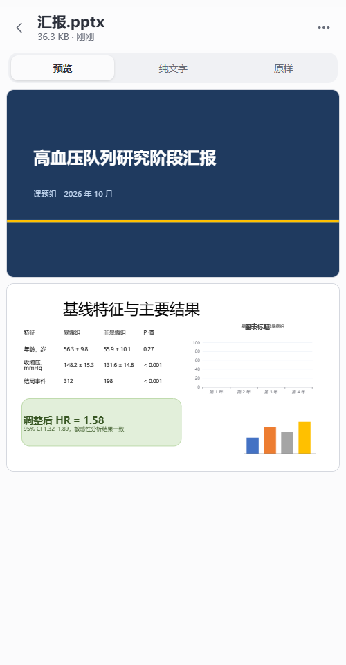

# 使用说明

[← 回到首页](../README.md)

从安装到日常使用的完整说明。只想尽快用上，看首页的“快速开始”就够了。

## 安装与连接

### 第 1 步：电脑上安装并打开

运行 `RemoteCli-Setup-x.y.z.exe`。安装位置可以改，点“浏览…”选别的盘或文件夹；选了已有内容的文件夹时，程序会装进里面新建的 `RemoteCli` 文件夹。

装完会自动打开主窗口，桌面和开始菜单里也会有 Remote CLI 的图标。以后想换位置，再运行一次安装程序选新位置即可，设置和密码会保留。

### 第 2 步：添加项目文件夹

第一次打开会停在“项目”页。点“添加文件夹”选你平时写代码的文件夹，或者把文件夹直接拖进窗口；可以加多个，也可以改名、移除。手机只能在这里列出的文件夹里开终端。

### 第 3 步：选连接方式

| 方式 | 什么时候用 | 要做什么 |
| --- | --- | --- |
| 局域网直连 | 手机和电脑连着同一个 Wi-Fi | 直接选它。第一次会弹出 Windows 防火墙询问，选“允许”。最快 |
| 公网隧道 | 人在外面，手头没有服务器 | 点“下载隧道程序”，确认后程序从 Cloudflare 的 GitHub 发布页下载 `cloudflared`（约 60 MB，只需一次），几秒后得到一个 https 地址。不需要注册账号 |
| 自有中转 | 有自己的服务器，想要固定地址 | 见 [自己部署中转](SELF_HOSTING.md) |

在“连接”页上方选方式。状态一行变成绿色、左边出现二维码，就可以用手机连了。

更新程序时隧道保持运行，地址不变，手机不用重新扫码；退出程序或重启电脑后地址会变，重新扫码即可。Cloudflare 不对这种临时隧道的可用性做保证，也需要你的网络能访问 GitHub 和 Cloudflare。隧道经常断开或手机上出现 1033 错误时，到“设置”把“公网隧道的协议”改为 HTTP/2。

### 第 4 步：手机上安装 App 并扫码

1. 在手机上安装 `RemoteCli-Android.apk` 并打开。
2. 点“扫码添加电脑”，第一次会询问相机权限，允许后对准电脑窗口里的二维码，识别到就自动连上。
3. 不想给相机权限或扫不了时，点“手动输入地址”，把电脑窗口里的“地址”和“密码”填进去。用手机系统相机扫那个二维码也可以，会跳回 App。

相机画面只在手机上用来找二维码，不保存也不上传。连上一次后 App 会记住这台电脑，90 天内不用再输密码。

## 手机上怎么用

App 有三层：**工作台**（所有电脑）→ **一台电脑**（它的项目和任务）→ **终端**。常用的路径是打开 App、在工作台点一个任务、直接进终端。

### 工作台：所有电脑和进行中的任务

只连了一台电脑时，打开 App 直接进入这台电脑；连了两台或更多时，打开 App 先看到工作台。在一台电脑的首页点左上角的“‹”，或按系统返回键，都能回到工作台。

- **进行中。** 所有电脑上开着的任务排在一起：等你确认的最前，其次是已完成还没看过的、正在执行的、等待输入的，最后是电脑上正在运行的 CLI 会话。每行标着状态、项目和所在的电脑。点手机终端直接进入，这时终端页左上角的“‹”回到工作台；点电脑上打开着的对话会先给你看它最近的内容，不用先进那台电脑。最多列 12 个，其余的在各自的项目里。
- **电脑。** 每台电脑一张卡片：圆点和一行文字说明它在线、离线还是需要重新登录，以及有几个任务等你。卡片里是它的项目，有任务在运行的排在前面，并按状态分别标出数量（等你确认、已完成、在执行），默认显示 4 个，点“其余 N 个项目”展开。点一个项目，它的对话就在工作台里展开：进行中的终端点开即进，历史对话点开即继续，再点一次项目收起；展开部分最下面一行进入项目，用来新建终端或查看更多历史。点电脑名称进入这台电脑的首页。同名项目始终分属于各自的电脑。
- **管理电脑。** 右上角的“＋”或列表末尾的“添加电脑”可以再扫一台。点电脑卡片右侧的“···”（或长按卡片）可以改名、重新扫码登录、从列表移除。电脑离线或登录过期时，卡片里会直接给出原因和“重新扫码”按钮。
- **新建终端。** 每台在线电脑的卡片最下面有“＋ 新建终端”：选一个项目和工具就能开，最近用过的项目排在前面，不用先进到项目里。

“进行中”的每个手机终端下面有一行小字，是它的程序最近说的一句话或正在做的事，随刷新更新，不用点进去就知道大概进展。

每台电脑单独读取，每 6 秒刷新一次；一台关机或连不上不会拖慢其它电脑。项目没有展开时只显示对话数量；展开后最多列出 8 段历史对话，其余的进项目后查看。

**外观。** 工作台右上角的圆形按钮设置外观，对所有电脑生效：“App 外观”用于工作台和每台电脑的列表；“终端外观”默认跟随 App，也可以单独选一套，例如列表用纸白、终端用夜航。

### 等你确认的任务：在列表里直接回答

程序停在一个是 / 否的提问上时，这台电脑的列表里那张卡片会把提问原样显示出来（终端画面的最后几行），下面是三个按钮：

| 按钮 | 作用 |
| --- | --- |
| 允许（回车） | 向终端发一个回车，Claude Code 和 Codex 的提问默认选中的是“是” |
| 拒绝（Esc） | 向终端发一个 Esc，即取消 |
| 进去看 | 打开终端，自己看全、自己选，例如选“以后不再询问” |

提问是从终端画面上的文字判断出来的，偶尔会判断错；所以卡片上一定带着原文，看清楚再点。

### 任务提醒

工作台最下面有一行“任务提醒”，默认关闭。开启后，App 不在前台时会留意每台电脑上的任务：有任务开始等你确认、或者做完了一轮，就发一条通知，点通知回到 App。

- 第一次开启时系统会询问通知权限（Android 13 及以上）。
- 留意期间通知栏里有一条“正在留意电脑上的任务”；回到 App 就停止。五分钟内没有任何任务在运行，或连续留意了八小时，也会自己停下。
- 它每二十秒向你的每台电脑问一次状态，和工作台刷新用的是同一个请求，不经过任何第三方服务。
- 刚离开 App 时已经在等你的任务不会再提醒一次；之后新出现的才提醒。

### 一台电脑：所有项目

 

最上面的“进行中”把这台电脑**所有项目**里开着的任务放在一起，最需要你的排在最前；下面是项目，每个项目也标着有几个任务等你处理。每个任务的状态各有一种颜色，工作台里用的是同一套：

| 状态 | 颜色 | 含义 |
| --- | --- | --- |
| 等你确认 | 红 | 程序停在一个是 / 否的提问上，例如是否允许执行命令 |
| 已完成 | 绿 | 干完了一轮活，你还没有点开看过 |
| 正在执行 | 黄 | 正在工作 |
| 等待输入 | 灰 | 空着，等你的下一条消息 |
| 正在启动 | 蓝 | 刚开，还没起来 |
| 已结束 / 异常退出 | 灰 / 红字 | 终端已经结束；异常退出是程序带着错误代码退出 |

“等你确认”是根据终端画面上的提问文字判断的，偶尔会判断错；任务卡片上的那行小字取自终端当前画面里最后一段话，画面里只有菜单或提示时可能不准。其余状态来自程序自身或最近有没有输出；只是重画画面的输出不算在执行，例如刚打开时的欢迎画面、在手机上打开终端引起的重绘、还没按回车的按键回显。

右上角的圆形按钮换配色和文字大小。在这里选的配色就是 App 外观，换到另一台电脑也是同一套，不随电脑变；下面两张是深色的“夜航”；“···”里可以添加项目、回到工作台、检查 App 更新、退出登录。

 

### 一个项目

- **新建。** 上面三个大按钮在这个项目文件夹里新建 Claude Code、Codex 或命令行终端（Windows 上是 PowerShell，Linux 上是你的 shell）。只显示电脑上装了的工具。
- **电脑上打开着。** 你在电脑上自己开的 Claude Code 或 Codex。点开先看到这段对话最近的内容：你问了什么、它答了什么、做了哪些操作。只是查看，电脑上的程序不受任何影响。看完再决定要不要“在手机上继续”，见下面的“电脑上打开着的对话”。
- **被电脑上其它程序占用的对话。** 由 Codex 桌面应用、编辑器或另一个远程终端打开着的对话折叠在这里，同样可以点开查看；它们不算在“电脑上打开着”的数量里。
- **历史对话。** 这个文件夹里保存过的对话，点开就继续；多的时候可以搜索。
- **最近结束。** 刚结束的终端，点开能看到它最后的画面。
- **文件。** 项目名下面的“文件”一行打开这个项目文件夹，见下面的“查看文件”。

### 电脑上打开着的对话

你在电脑上自己开的命令行窗口属于它自己，Remote CLI 拿不到它的画面，所以手机不能直接接着那个窗口用。点开这样的对话，先看到的是它最近的内容，下面才是可以做的事：

| 选项 | 会发生什么 |
| --- | --- |
| 在手机上继续 | 电脑上的那个窗口会关闭，正在执行的任务会中断；同一段对话在手机上接着用 |
| 我已在电脑上关掉它，在手机上继续 | 程序不能确定是谁在用这段对话时出现。它不会去关任何东西；对话确实已经没人用了才会继续，否则告诉你原因 |
| 另开一份继续（Codex） | 带着到现在为止的内容新开一段，电脑上的那段不受影响，之后各走各的 |

想两边都能用同一个终端、不用来回交接，见下一节。

### 手机和电脑共用一个终端

从手机上新建的终端，或在电脑端“活动”页点“新建或查看全部”打开的终端，由 Remote CLI 自己持有，手机和电脑看到的是同一个画面，谁输入都行：

- 在电脑端“活动”页双击一个终端（或选中后点“在电脑上打开”），电脑上会出现一个窗口，里面就是手机上的那个终端。手机上照常能看、能输入，不需要交接，任务也不会中断。
- “新建或查看全部”打开的窗口和手机上一台电脑的页面相同：可以新建终端、继续历史对话、查看文件。在这里开的终端，手机上也能看到。
- 两边窗口大小不同，程序的画面只能按一个大小来画：按最后输入的那一方。在另一边输入一下，画面就会按那一边重新排好。
- 窗口用 Edge 或 Chrome 的无地址栏方式打开，没有它们时用默认浏览器；登录用的是只能用一次、一分钟内有效的票据，密码不会出现在地址里。

“转成独立窗口”是原来的做法：结束这个终端，在电脑的命令行窗口里接着同一段对话，手机上不再能看到它。只在确实想让它脱离 Remote CLI 时使用；PowerShell 没有可恢复的对话，不能转。

### 终端页

| 位置 | 作用 |
| --- | --- |
| 下面一行按键 | 最常用的在前：Esc、↑、↓、回车、Tab、Shift+Tab、Ctrl+C；向左滑还有 ←、→、PgUp、PgDn |
| 输入框 | 输入后点“发送”；空着点“回车”相当于按一次回车。输入 `/` 会列出 Claude Code 或 Codex 的常用命令 |
| 话筒 | 系统语音识别，识别结果先进输入框，确认后再发送。手机没有自带语音识别时（很多国内品牌的手机如此）不显示这个按钮，请用输入法键盘上的语音键 |
| 手指上下拖动 | 按屏幕帧翻看之前的内容，松手后短暂惯性滑动；新触摸或反向拖动会停止惯性 |
| 右上角文件夹 | 打开这个终端所在项目的文件；看完按左上角 ‹ 或手机的返回键回到终端，终端一直在电脑上运行 |
| 右上角 Aa | 切换字号（四档） |
| 右上角 ··· | 更换外观（只改终端自己的外观，也可以选回“跟随 App 外观”）、行距（紧凑、适中、宽松）、重命名、复制终端画面、结束终端；画面花屏时可以改用兼容绘制。重命名和结束终端在同一块底部面板里填写和确认 |
| 左上角 ‹ | 回到来的地方（工作台或这台电脑的列表），终端继续在电脑上运行 |
| 点标题 | 切换到这台电脑上别的正在运行的终端，不用先回列表；标题旁的数字是另外还有几个在运行 |
| 标题下出现的一行 | 别的任务完成了或在等你确认，点“切换”直接过去 |

### 查看文件

在手机上翻看项目文件夹，像资源管理器一样逐层进入；点文件直接查看，不用先传到手机。只读，不会改动电脑上的任何文件。

| 文件 | 怎么显示 |
| --- | --- |
| 代码和文本 | 带行号和语法着色，配色随当前外观；长行可左右滑动，也可在右上角改为自动换行 |
| Markdown | 排好版的文档，含表格、代码块、任务列表和同文件夹里的图片；可切换到源码 |
| Jupyter 笔记本 | 按单元格显示文字、代码和已保存的输出（文本、表格、图片） |
| Word（docx） | 带格式的预览，按屏幕宽度排，见下面的说明 |
| Excel（xlsx、xls）和 CSV | 表格，多张表可切换；首行和行号固定；最多显示前 2000 行、80 列 |
| PowerPoint（pptx） | 一张张幻灯片的预览，见下面的说明 |
| PDF | 逐页显示，滚动到哪页画哪页 |
| 图片 | 适应屏幕，点一下看原始大小 |

 

**Word 和 PowerPoint** 点开就是带格式的预览，由手机页面自己排出来，不用等，电脑上也不需要装任何软件。Word 的标题、加粗和颜色、表格的边框和底色、列表、图片都保留，并且按手机屏幕的宽度排，不用放大就能读；不分页，也不显示页眉页脚。PowerPoint 一张张显示幻灯片，每张和屏幕一样宽：背景、形状、图片和文字的位置是对的，但从母版继承的字号和项目符号、表格的主题样式、图表不一定和原来一样。要看和电脑上完全一致的样子，或者是旧格式的 doc、ppt，请保存到手机后用别的应用打开。

右上角可以按名称、修改时间或大小排列，显示隐藏的文件。预览有大小上限（文本 3 MB，图片和表格 30 MB，Word 40 MB，PDF 和演示文稿 60 MB），超过的和不认识的类型只显示名称和大小。

任何文件都可以保存到手机：查看时点右上角“···”里的“保存到手机”，不能预览的文件页面上直接有这个按钮。文件放在手机的“下载 / RemoteCLI”里（Android 10 及以上），保存后可以立即用手机上的其它应用打开；单个文件上限 300 MB。在浏览器里使用时，按浏览器的普通下载处理。

### 更新电脑端

人不在电脑前也可以更新电脑端：在一台电脑的页面右上角“···”里，能看到电脑端当前版本；有新版本时点“更新电脑端”，没有时点“检查电脑端更新”。更新时手机会断开几秒，之后自动恢复：公网隧道的地址不变；Claude Code 和 Codex 的终端接回原来的对话，PowerShell 终端在原文件夹重新打开。正在执行的任务会被这次重启打断，请等它们做完再更新。

电脑端“设置”里另有“自动更新”开关，默认关闭；打开后，电脑端每十分钟检查一次，在没有终端忙碌时自己更新。

### 外出和单手使用

- 需要点的东西都不小于一个指尖，选项从屏幕底部弹出，拇指够得到。
- 离开 App 不影响电脑上的任务。回来时工作台和列表会立即刷新，“已完成”的标记保留到你点开看过为止。
- 在外面用公网隧道或自己的 https 中转；`http://` 开头的局域网地址只适合家里或办公室的 Wi-Fi。
- 连接断开时 App 会回到工作台并说明原因。电脑端更新后隧道地址不变，等它重新启动即可；退出后重新打开或重启电脑，隧道地址会变，点“重新扫码”即可，原来的名称会保留。

## 自动更新

电脑端启动、手机端启动或回到前台时会检查 GitHub Releases 的最新正式版本，自动检查最多每 6 小时一次。发现新版本后会提示：电脑端下载并校验安装包，等当前程序退出后自动替换并重启；手机端校验 APK 后交给 Android 系统安装器，第一次可能需要允许“安装未知应用”。更新只接受本仓库 `KangWang42/remote-cli` 的 HTTPS 发布文件。也可以手动检查：电脑端在“设置”页最下面一行；手机在工作台底部的“版本 x.y.z · 检查更新”，或进入一台电脑后右上角“···”里的“检查 App 更新”。

## 停止和卸载

- 关掉电脑上的窗口只是收到右下角托盘，手机仍然能连。要停止，在托盘图标上点右键选“退出”。
- “设置”里关掉“允许手机访问”可以立刻挡住手机，不用退出程序。
- “活动”页能看到手机上开着哪些终端、各自在执行还是在等输入。

- 卸载：Windows“设置 → 应用”里找到 Remote CLI，或运行安装目录里的 `Uninstall.exe`。只删除安装程序放进去的文件，同一文件夹里的其他东西不动。
